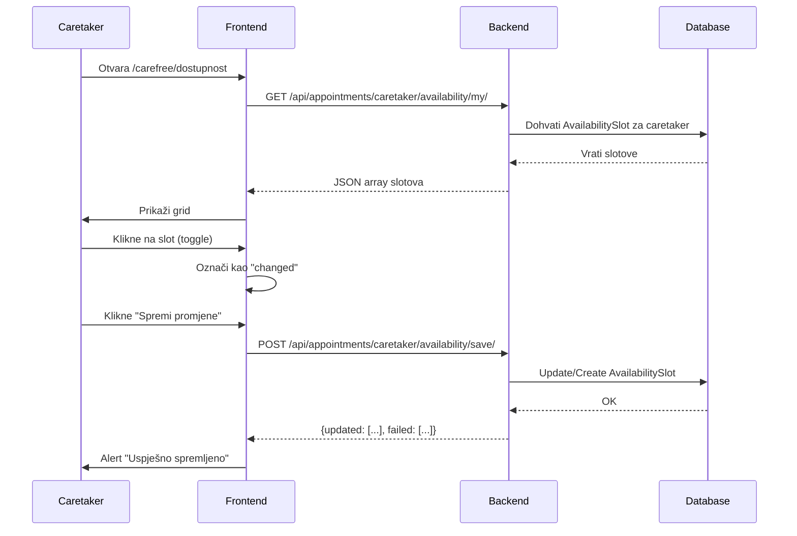
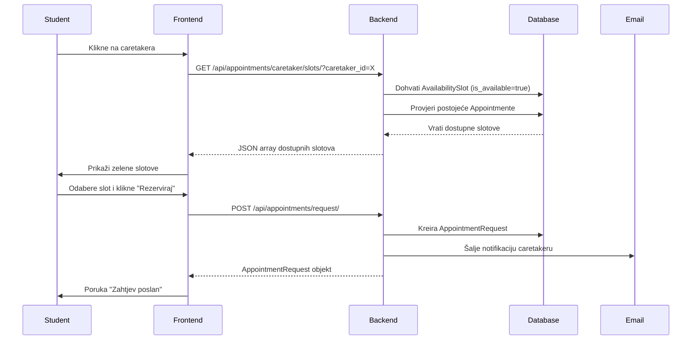

# Caretaker Availability Feature - Dokumentacija

## 📋 Pregled

Nova funkcionalnost omogućava caretakerima (psiholozima) da ručno postavljaju svoju dostupnost za razgovore sa studentima. Student može rezervirati termin samo za vrijeme koje je caretaker označio kao dostupno.

---

## ✨ Što je dodano

### Backend

#### 1. **Novi API Endpoint**
```
GET /api/appointments/caretaker/availability/my/?days=7
```
- **Autentikacija**: Potreban Bearer token (caretaker)
- **Query parametri**:
  - `days` (optional, default=7): Broj dana unaprijed
- **Odgovor**: Array availability slotova
```json
[
  {
    "start": "2026-01-23T09:00:00+01:00",
    "end": "2026-01-23T10:00:00+01:00",
    "is_available": true,
    "has_appointment": false
  },
  ...
]
```

#### 2. **Postojeći Endpoint za Spremanje**
```
POST /api/appointments/caretaker/availability/save/
```
Ovaj endpoint već postoji i koristi se za bulk spremanje dostupnosti.

**Payload**:
```json
{
  "slots": [
    {
      "slot": "2026-01-23T09:00:00.000Z",
      "is_available": true
    },
    {
      "slot": "2026-01-23T10:00:00.000Z",
      "is_available": false
    }
  ]
}
```

### Frontend

#### 1. **Novo korisničko sučelje**: `/carefree/dostupnost`

**Značajke**:
- 📅 **Grid prikaz** - 7 dana × 11 sati (8:00-18:00)
- 🎨 **Vizualni indikatori**:
  - 🟢 **Zeleno** - Dostupan slot
  - ⚪ **Sivo** - Nedostupan slot
  - 🔵 **Plavo** - Zakazan termin (ne može se mijenjati)
  - 🟡 **Žuta obruba** - Nespremljena promjena
- 👆 **Klik interakcija** - Jednostavno kliknite na slot da promijenite dostupnost
- 💾 **Batch spremanje** - Sve promjene se spremaju odjednom
- 🔄 **Refresh** - Mogućnost osvježavanja podataka

#### 2. **Nove kartice na Dashboardu**
- 🔵 **"Termini"** - Pregled zakazanih termina (kalendar prikaz) - `/carefree/availability`
- 🟢 **"Dostupnost"** - Postavljanje dostupnosti (grid prikaz) - `/carefree/dostupnost`

---

## 🔧 Kako koristiti (Caretaker perspektiva)

### 1. Prijava kao Caretaker
Login na aplikaciju s caretaker accountom.

### 2. Otvaranje stranice za dostupnost
- Kliknite na karticu **"Dostupnost"** na dashboardu (zelena)
- Ili idite direktno na `/carefree/dostupnost`

### 3. Postavljanje dostupnosti
1. **Grid prikazuje 7 dana** - Od danas do +7 dana
2. **Satnice 8:00-18:00** - 11 slotova dnevno
3. **Kliknite na slot** da ga označite kao dostupan (zeleno)
4. **Kliknite ponovno** da poništite dostupnost (sivo)
5. **Kliknite "Spremi promjene"** kada završite

### 4. Pravila
- ❌ **Ne možete mijenjati slotove sa zakazanim appointmentom** (plavi)
- ❌ **Ne možete postavljati dostupnost za prošlo vrijeme**
- ✅ **Možete postavljati dostupnost do 7 dana unaprijed**
- ⚠️ **Promjene se ne spremaju automatski** - morate kliknuti "Spremi"

---

## 📊 Kako funkcionira (Student perspektiva)

### 1. Student traži caretakera
- Student ide na stranicu za pretragu caretakera
- Klikne na željenog caretakera

### 2. Student vidi dostupne termine
- API poziva `GET /api/appointments/caretaker/slots/?caretaker_id=<id>&days=7`
- Vraćaju se **SAMO** slotovi koje je caretaker označio kao dostupne
- Zauzeti slotovi (sa appointmentom) se **ne prikazuju**

### 3. Student rezervira termin
- Bira dostupan slot
- Šalje zahtjev za termin
- Caretaker dobije email notifikaciju i mora odobriti

---

## 🔄 Backend Flow

### Postavljanje dostupnosti (Caretaker)



### Rezervacija termina (Student)



---

## 🧪 Testiranje

### Test Case 1: Caretaker postavlja dostupnost

**Koraci**:
1. Login kao caretaker
2. Idi na `/carefree/availability`
3. Klikni na nekoliko slotova (sutra u 10:00, 11:00, 14:00)
4. Provjeri da su zeleni
5. Klikni "Spremi promjene"
6. Osvježi stranicu
7. Provjeri da su slotovi još uvijek zeleni

**Očekivani rezultat**: ✅ Slotovi ostaju označeni kao dostupni

---

### Test Case 2: Student vidi dostupne slotove

**Koraci**:
1. Login kao student
2. Traži caretakera
3. Klikni na caretakera koji je postavio dostupnost
4. Provjeri prikazane slotove

**Očekivani rezultat**: ✅ Student vidi SAMO slotove koje je caretaker označio kao dostupne

---

### Test Case 3: Caretaker ne može mijenjati zauzete slotove

**Preduvjeti**: Student je rezervirao termin koji je caretaker odobrio

**Koraci**:
1. Login kao caretaker
2. Idi na `/carefree/availability`
3. Pronađi plavi slot (zakazan appointment)
4. Pokušaj kliknuti na njega

**Očekivani rezultat**: ✅ Slot je disabled, ne mijenja se

---

### Test Case 4: Nespremljene promjene

**Koraci**:
1. Login kao caretaker
2. Idi na `/carefree/availability`
3. Klikni na nekoliko slotova
4. **NE klikni** "Spremi promjene"
5. Osvježi stranicu (F5)

**Očekivani rezultat**: ✅ Promjene se gube, vraćaju se na staro stanje

---

## 🐛 Troubleshooting

### Problem: "Ne vidim svoje slotove nakon spremanja"

**Rješenje**:
- Kliknite "Osvježi" button
- Provjerite konzolu za greške
- Provjerite network tab - da li je `/save/` vraćao `{updated: [...]}`

---

### Problem: "Student ne vidi moje dostupne slotove"

**Provjere**:
1. Jeste li kliknuli "Spremi promjene"?
2. Jesu li slotovi označeni kao zeleni (is_available=true)?
3. Provjerite backend log - `/api/appointments/caretaker/slots/`
4. Student gleda za sljedeći tjedan, a vi ste postavili za ovaj tjedan?

---

### Problem: "Greška pri spremanju"

**Mogući razlozi**:
- **Occupied slot**: Pokušavate mijenjati slot sa appointmentom
- **Invalid format**: Problem s JSON formatom ili timezone
- **Permissions**: Niste prijavljeni kao caretaker

**Debug**:
- Otvorite Network tab u browseru
- Kliknite "Spremi promjene"
- Pogledajte response od `/save/` endpointa
- Provjerite `failed` array u odgovoru

---

## 📝 Tehnički detalji

### Modeli (Backend)

#### AvailabilitySlot
```python
class AvailabilitySlot(models.Model):
    caretaker = ForeignKey(Caretaker)
    start = DateTimeField()  # UTC
    end = DateTimeField()    # UTC
    is_available = BooleanField(default=True)
    created_at = DateTimeField(auto_now_add=True)
```

**Pravila**:
- `end - start` mora biti točno 1 sat
- `unique_together = [("caretaker", "start")]`
- Slotovi se spremaju u UTC, prikazuju u Europe/Zagreb

---

### API Response Format

#### GET /caretaker/availability/my/
```typescript
interface AvailabilitySlot {
  start: string;          // ISO 8601 sa timezone offset
  end: string;            // ISO 8601 sa timezone offset
  is_available: boolean;  // True = dostupan, False = nedostupan
  has_appointment: boolean; // True = ima zakazan appointment
}
```

#### POST /caretaker/availability/save/
```typescript
// Request
interface SaveRequest {
  slots: Array<{
    slot: string;           // ISO 8601 datetime
    is_available: boolean;
  }>;
}

// Response
interface SaveResponse {
  updated: Array<{
    slot: string;
    created: boolean;       // True ako je novi slot
    is_available: boolean;
  }>;
  failed: Array<{
    slot: string;
    reason: string;         // 'occupied' | 'invalid_format' | 'missing_slot'
  }>;
}
```

---

## 🔐 Permissions

| Endpoint | Required Role | Required Auth |
|----------|---------------|---------------|
| `GET /caretaker/availability/my/` | Caretaker | Bearer token |
| `POST /caretaker/availability/save/` | Caretaker | Bearer token |
| `GET /caretaker/slots/` | Any authenticated | Bearer token |

---

## 📅 Roadmap / Buduće nadogradnje

Moguća poboljšanja:
- [ ] Bulk odabir (npr. "Označi cijeli dan")
- [ ] Ponavljajuća dostupnost (npr. "Svaki ponedjeljak 10-12")
- [ ] Export kalendara u iCal format
- [ ] Push notifikacije kada student rezervira termin
- [ ] Statistika najčešće rezerviranih termina

---

## 📞 Support

Za dodatna pitanja ili probleme, kontaktirajte razvojni tim.

**Last Updated**: January 23, 2026
